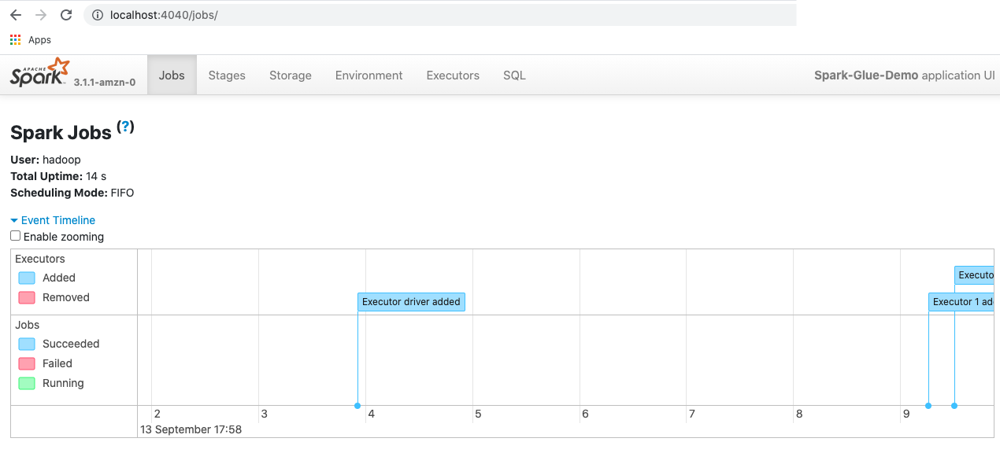

# **Connect to Spark UI running on the Driver Pod**

To obtain more detail about their application or monitor their job execution, Spark application developers can connect to Spark-UI running on the Driver Pod.

Spark UI (Spark history server) is packaged with EMR on EKS out of the box. Alternatively, if you want to see Spark UI immediately after the driver is spun up, you can use the instructions in this page to connect.

This page shows how to use `kubectl port-forward` to connect to the Job's Driver Pod running in a Kubernetes cluster. This type of connection is useful for debugging purposes.

**Pre-Requisites**

* AWS cli should be installed
* "kubectl" should be installed
* If this is the first time you are connecting to your EKS cluster from your machine, you should run `aws eks update-kubeconfig --name --region` to download kubeconfig file and use correct context to talk to API server.

### Submitting the job to a virtual cluster

**Request** 
```
cat >spark-python.json << EOF
{
  "name": "spark-python-in-s3", 
  "virtualClusterId": "<virtual-cluster-id>", 
  "executionRoleArn": "<execution-role-arn>", 
  "releaseLabel": "emr-6.3.0-latest", 
  "jobDriver": {
    "sparkSubmitJobDriver": {
      "entryPoint": "s3://<s3 prefix>/trip-count.py", 
       "sparkSubmitParameters": "--conf spark.driver.cores=4  --conf spark.executor.memory=20G --conf spark.driver.memory=20G --conf spark.executor.cores=4"
    }
  }, 
  "configurationOverrides": {
    "applicationConfiguration": [
      {
        "classification": "spark-defaults", 
        "properties": {
            
         }
      }
    ], 
    "monitoringConfiguration": {
      "cloudWatchMonitoringConfiguration": {
        "logGroupName": "/emr-containers/jobs", 
        "logStreamNamePrefix": "demo"
      }, 
      "s3MonitoringConfiguration": {
        "logUri": "s3://joblogs"
      }
    }
  }
}
EOF
aws emr-containers start-job-run --cli-input-json file:///spark-python.json
```


Once the job is submitted successfully, run `kubectl get pods -n <virtual-cluster-k8s-namespace> -w ` command to watch all the pods, until you observe the driver pod is in the "Running" state. The Driver pod's name usually is in `spark-<job-id>-driver` format.


### Connecting to the Driver Pod

Spark Driver Pod hosts Spark-UI on port `4040`. However the pod runs within the internal Kubernetes network. To get access to the internal Kubernetes resources, `kubectl` provides a tool ("Port Forwarding") that allows access from your localhost. To get access to the driver pod in your cluster:


1- Run ```kubectl port-forward <driver-pod-name> 4040:4040```

The result should be the following:


```
Forwarding from 127.0.0.1:28015 -> 27017
Forwarding from [::1]:28015 -> 27017
```

2- Open a browser and type `http://localhost:4040` in the Address bar.

You should be able to connect to the Spark UI:

