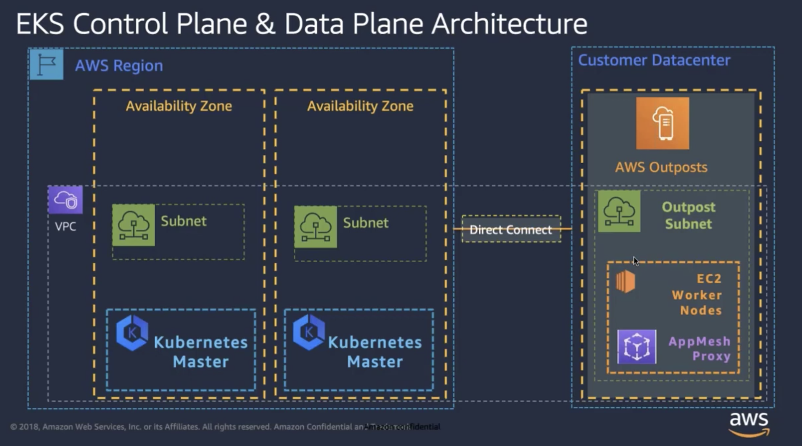

# Running EMR Containers on AWS Outposts
## Background
You can now create and run Amazon EMR Container jobs on AWS EKS clusters running on AWS Outposts. AWS Outposts enables native AWS services, infrastructure, and operating models in on-premises facilities. In AWS Outposts environments, you can use the same AWS APIs, tools, and infrastructure that you use in the AWS Cloud. Amazon EKS nodes on AWS Outposts is ideal for low-latency workloads that need to be run in close proximity to on-premises data and applications. Visit the AWS EKS on Outposts [documentation page](https://docs.aws.amazon.com/eks/latest/userguide/eks-on-outposts.html) for more information, pre-requisites and considerations.

This document provides the steps necessary to setup EMR Containers on AWS Outposts.



## Key Considerations and Recommendations
* The EKS Cluster being created on the Outpost must be created with self-managed node groups.
  * Use the AWS Management Console+CloudFormation to create a self-managed node group in Outposts
* For EMR workloads, we recommend creating EKS clusters where all the worker nodes reside in the Outposts self-managed node group.
* AWS Fargate is not available on Outposts.
* Regions supported, prerequisites and considerations for EKS on Outposts - https://docs.aws.amazon.com/eks/latest/userguide/eks-on-outposts.html


## Infrastructure Setup
### Setup EKS on Outposts
**Network Setup**  

* Setup a VPC  

  ```
aws ec2 create-vpc \
--region <us-west-2> \
--cidr-block '<10.0.0.0/16>'
  ```  


In the output that's returned, take note of the VPC ID. 

 
  ```
{
    "Vpc": {
        "VpcId": "vpc-123vpc", 
        ...
    }
}
  ```


* Create two subnets in the parent region
```
aws ec2 create-subnet \
    --region '<us-west-2>' \
    --availability-zone-id '<usw2-az1>' \
    --vpc-id '<vpc-123vpc>' \
    --cidr-block '<10.0.1.0/24>'

aws ec2 create-subnet \
    --region '<us-west-2>' \
    --availability-zone-id '<usw2-az2>' \
    --vpc-id '<vpc-123vpc>' \
    --cidr-block '<10.0.2.0/24>'
```
In the output that's returned, take note of the Subnet ID.
```
{
    "Subnet": {
        "SubnetId": "subnet-111",
        ...
    }
}
{
    "Subnet": {
        "SubnetId": "subnet-222",
        ...
    }
}
```


* Create a subnet in the Outpost AZ (This step is different for Outposts)

```
aws ec2 create-subnet \
    --region '<us-west-2>' \
    --availability-zone-id '<usw2-az1>' \
    --outpost-arn 'arn:aws:outposts:<us-west-2>:<123456789>:outpost/<op-123op>' \
    --vpc-id '<vpc-123vpc>' \
    --cidr-block '<10.0.3.0/24>'
```
In the output that's returned, take note of the Subnet ID.

```
{
    "Subnet": {
        "SubnetId": "subnet-333outpost",
        "OutpostArn": "..."
        ...
    }
}
```


  
**EKS Cluster Creation** 

  
* Create an EKS cluster using the three subnet Ids created earlier
```
aws eks create-cluster \
    --region '<us-west-2>' \
    --name '<outposts-eks-cluster>' \
    --role-arn 'arn:aws:iam::<123456789>:role/<cluster-service-role>' \
    --resources-vpc-config  subnetIds='<subnet-111>,<subnet-222>,<subnet-333outpost>'
```

* Check until the cluster status becomes active
```
aws eks describe-cluster \
    --region '<us-west-2>' \
    --name '<outposts-eks-cluster>'
```
Note the values of resourcesVpcConfig.clusterSecurityGroupId and identity.oidc.issuer
```
{
    "cluster": {
        "name": "outposts-eks-cluster",
        ...
        "resourcesVpcConfig": {
            "clusterSecurityGroupId": "sg-123clustersg",
        },
        "identity": {
            "oidc": {
                "issuer": "https://oidc.eks.us-west-2.amazonaws.com/id/oidcid"
            }
        },
        "status": "ACTIVE",
    }
}
```
* Add the Outposts nodes to the EKS Cluster
At this point, eksctl cannot be used to launch self-managed node groups in Outposts. Please follow the steps listed in the self-managed nodes [documentation page](https://docs.aws.amazon.com/eks/latest/userguide/launch-workers.html#aws-management-console). In order to use the cloudformation script lised in the AWS Management Console tab, make note of the following values created in the earlier steps:
* ClusterName: ```<outposts-eks-cluster>```
* ClusterControlPlaneSecurityGroup: ```<sg-123clustersg>```
* Subnets: ```<subnet-333outpost>```

Apply the aws-auth-cm config map listed on the documentation page to allow the nodes to join the cluster.

### Register cluster with EMR Containers
Once the EKS cluster has been created and the nodes //docs.aws.amazon.com/emr/latest/EMR-on-EKS-DevelopmentGuide/setting-up.html). Since the cluster is already setup, only the following steps need to be performed:

* Enable cluster access for Amazon EMR on EKS
* Enable IAM Roles for Service Accounts (IRSA) on the EKS cluster
* Create a job execution role
* Update the trust policy of the job execution role
* Grant users access to Amazon EMR on EKS
* Register the Amazon EKS cluster with Amazon EMR


## Conclusion
EMR-EKS on Outposts allows users to run their big data jobs in close proximity to on-premises data and applications.
