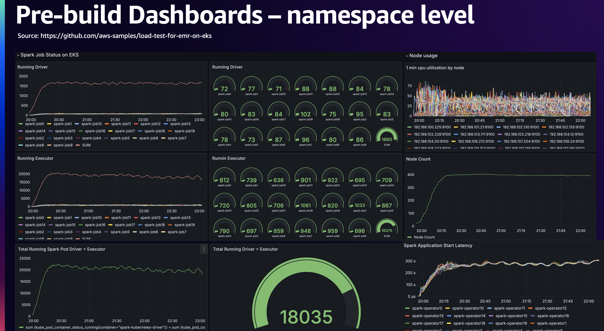
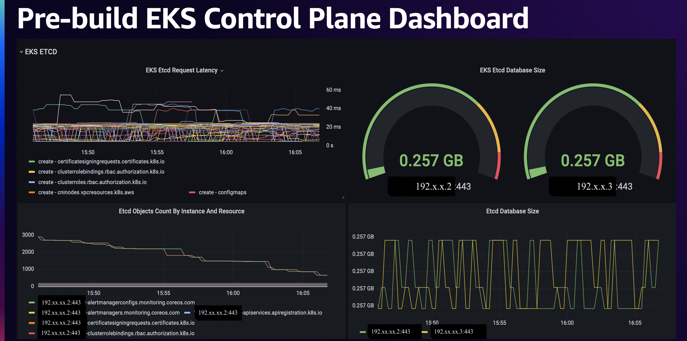
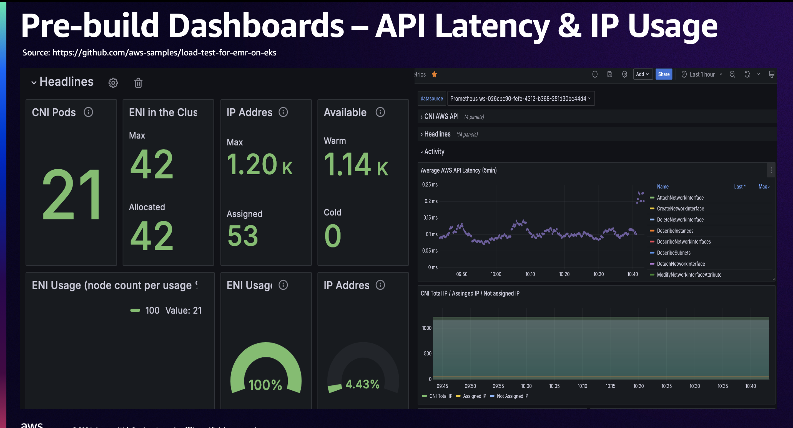
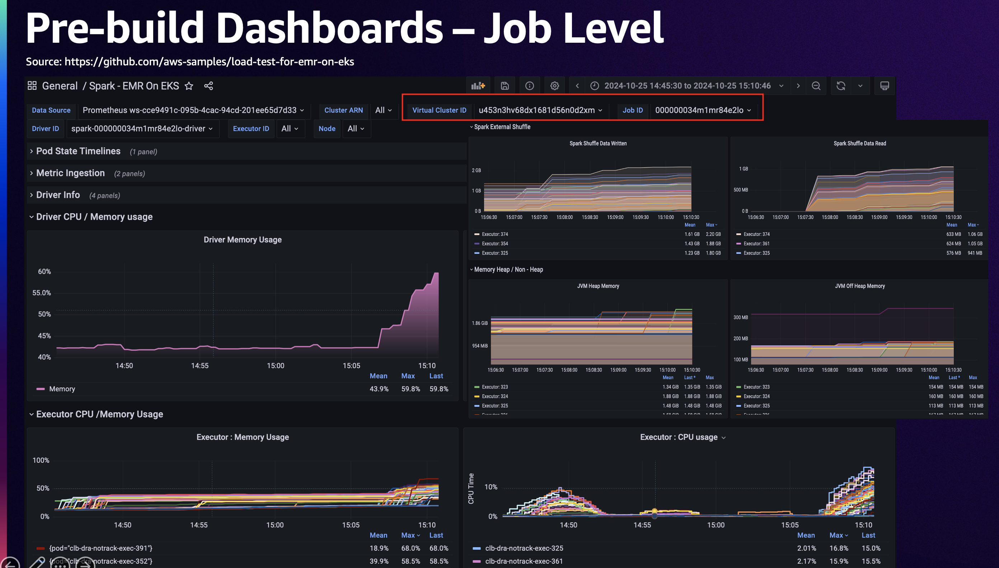

# Grafana Dashbaords

* [Spark Operator Dashboard Template](https://github.com/aws-samples/load-test-for-emr-on-eks/blob/main/grafana/dashboard-template/spark-operator-dashbord.json)

* [EKS Control Plane & Etcd DB monitoring](https://github.com/aws-samples/load-test-for-emr-on-eks/blob/main/grafana/dashboard-template/eks-control-plane.json)

* [CNI usage dashbaord](https://github.com/aws-samples/load-test-for-emr-on-eks/blob/main/grafana/dashboard-template/aws-cni-metrics.json)

* [EMR on EKS Job dashbaord](https://github.com/awslabs/data-on-eks/tree/main/analytics/terraform/emr-eks-karpenter/emr-grafana-dashboard)

