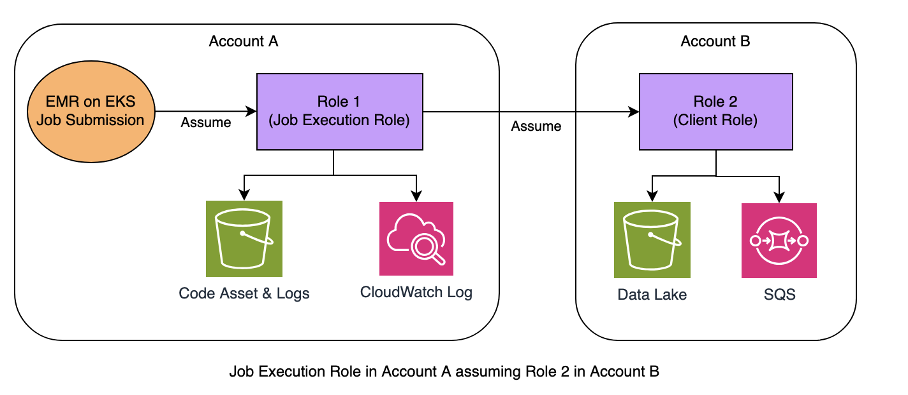

# Chaining IAM Roles With AWS Profile

AWS STS allows you assume one role and then use the temporary credentials to assume another role. You can continue from session to session. This is called **[role chaining](https://docs.aws.amazon.com/IAM/latest/UserGuide/id_roles.html#iam-term-role-chaining)**. 

In Amazon EMR on EKS, role chaining technique helps us to simplify EKS authentication design for use cases like:

**1. Cross-Account Access:** it allows pods to switch from AssumeRoleWithWebIdentity ( Job Execution role ) to a different user role in another AWS account by chaining sts:AssumeRole calls, enabling cross-account access and secure credential management. 

**2. Session Switching:** within a Spark application, you can seamlessly switch from a Spark to an AWS SDK credential session, (like Boto3 session) by assuming a different role.

Role chaining capability improves scalability and flexibility in EMR on EKS submission type while maintaining the best practices in security.

<div style="border: 1px solid red; padding: 10px; background-color: #f8d7da;">
  <strong>NOTE:</strong>
  <br>
  1. Role chaining session is limited to a maximum of one hour. If you use the "DurationSeconds" parameter to provide a value greater than one hour, the operation fails.
  <br>
  2. Role chaining doesn't work with Java SDK based application running in EKS. This is <a href="https://github.com/aws/aws-sdk-java/issues/2602">a well-known issue</a>. The workaround is to check the <a href="https://docs.aws.amazon.com/sdk-for-java/v1/developer-guide/credentials.html#credentials-default">order of AWS Credentials Provider Chain</a> and use a CredentialsProvider in the chain before WebIdentityTokenFileCredentialsProvider is evaluated. Or force to use ProfileCredentialsProvider in Java code.
</div>

## Role Chaining Demonstration

As an exmaple, we will use the following configuration to demonstrate role chaining pattern in EMR on EKS.

```yaml
Account A (EKS Cluster):
    IAM Role: job-execution-role-1
    Trust Policy: Allows the EKS cluster's OIDC provider to assume this role.
    Policy: S3 & CloudWatch Permissions in Account A. Allows "sts:AssumeRole" for the role "client-role-2" in Account B. 

Account B (Target Account):
    IAM Role: client-role-2
    Trust Policy: Allows the "job-execution-role-1" from Account A to assume this role.
    Policy: S3 & SQS Permissions in Account B. 
```
  

### 1. Prerequisites

- **Job Execution IAM Role**: You need to have [IRSA enabled](https://docs.aws.amazon.com/emr/latest/EMR-on-EKS-DevelopmentGuide/setting-up-enable-IAM-service-accounts.html) in your EKS cluster to associate this IAM role with Kubernetes service account in EMR Virtual Cluster's namespace. Or allow [Pod Identity for EKS Auth](https://docs.aws.amazon.com/emr/latest/EMR-on-EKS-DevelopmentGuide/setting-up-enable-IAM.html#setting-up-enable-IAM-pod-create-job-role))


- **Add Assume Role Permission**: Grant the `job-execution-role-1` in Account A with STS Assume role permission to assume `Client-Role-2` in Account B.
```bash
{
    "Version": "2012-10-17",
    "Statement": [
        {
            "Effect": "Allow",
            "Action": "sts:AssumeRole",
            "Resource": "arn:aws:iam::$ACCOUNTB:role/client-role-2"
        }
    ]
}
```
* [full version of IAM policy](../resources/job-exec-role-1-policy.json) in Role 1

* [full version of trust policy](../resources/job-exec-role-1-policy.json) in Role 1

### 2. Setup Chain IAM Role

In this example, a Spark application in EKS Cluster of Account A needs to access resources (S3 and SQS) in Account B. The `Job-Execution-Role-1` in Account A has a policy that allows it to assume the `client-role-2` in Account B (using sts:AssumeRole), which is a chained role. 

- **Add Trust Policy**: client-role-2 in Account B needs a trust policy that allows Job-Execution-Role-1 in Account A to assume it. 
```bash
{
    "Version": "2012-10-17",
    "Statement": [
        {
            "Effect": "Allow",
            "Principal": {
                "AWS": "arn:aws:iam::$ACCOUNTA:role/job-execution-role-1"
            },
            "Action": "sts:AssumeRole"
        }
    ]
}
```
* [full version of IAM policy](../resources/client-role-2-policy.json)
* [full version of trust policy](../resources/client-role-2-trust-policy.json) (as above)

### 3. Build a Custom Docker Image

After the role 1 and role 2 are fully setup, now we need to create a chained profile file `~/.aws/config` in each Spark pod, so our jobs can assume chained roles with zero code change. 
The "AWS Profile" format looks like this:
```bash
[profile default]
source_profile = irsa-role-1
role_arn=arn:aws:iam::$ACCOUNTB:role/client-role-2

[profile irsa-role-1]
web_identity_token_file = /var/run/secrets/eks.amazonaws.com/serviceaccount/token
role_arn=arn:aws:iam::$ACCOUNTA:role/job-execution-role-1
```
**NOTE:** profile name of `client-role-2` MUST be `default`. However, the job execution role's profile name is flexible.

To produce the profile file in each pod, we build a custom docker image containing the [custom-entrypoint.sh](../resources/custom-entrypoint.sh) - a script to populate the AWS profiles. Ensure the entrypoint script is located to the same directory as your Dockerfile.

A sample [Dockerfile](../resources/Dockerfile) looks like this:
```bash
FROM public.ecr.aws/emr-on-eks/spark/emr-6.15.0:latest

USER root

RUN mkdir -p /usr/lib/poc
COPY custom-entrypoint.sh /usr/lib/poc/entrypoint.sh
RUN chown -R hadoop:hadoop /usr/lib/poc
RUN chmod -R a+x /usr/lib/poc

USER hadoop:hadoop
ENTRYPOINT ["/usr/lib/poc/entrypoint.sh"]
```

Let's build the custom image:
```bash
# login to public ECR first
aws ecr-public get-login-password --region us-east-1 | docker login --username AWS --password-stdin public.ecr.aws
# login to a private ECR
export AWS_REGION=us-east-1
export ACCOUNT_ID=$(aws sts get-caller-identity --query Account --output text)
export ECR_URL=$ACCOUNT_ID.dkr.ecr.$AWS_REGION.amazonaws.com

aws ecr get-login-password --region $AWS_REGION | docker login --username AWS --password-stdin $ECR_URL

# one-off: create a new ECR repo
aws ecr create-repository --repository-name spark --image-scanning-configuration scanOnPush=true
```
Finally, build and publish the image supporting x86 & arm64 both. Refer to the [Build Multi-arch Docker Image](https://aws.github.io/aws-emr-containers-best-practices/submit-applications/docs/spark/multi-arch-image/) section if you don't have buildx enabled in your environment.
```bash
docker buildx build --platform linux/amd64,linux/arm64 \
-t $ECR_URL/spark/emr6.15_custom \
--push .
```

### 4.Submit Sample Job

**Case 1: Test pure Boto3 with cross-account access**


- Download the sample [Boto3 application](../resources/only-boto3.py) to Account A S3 bucket `emr-on-eks-test-AccountA-us-east-1`, which stores library dependecies, logs and source code only.

The sample Python application lists S3 object name and size, then send the infomation to an SQS queue in a target Account. 
Code Snippet for - **only-boto3.py**:
```python
s3 = boto3.client('s3', region_name='us-east-1')
objects = []
try:
    response = s3.list_objects_v2(Bucket=bucket_name, Prefix=prefix)
    if 'Contents' in response:
        print(f"Files in bucket '{bucket_name}':")
        for obj in response['Contents']:
            print(f"- {obj['Key']} (Size: {obj['Size']} bytes)")
            objects.append(obj['Key'])
......
```
- Before we submit the EMR on EKS job, create an SQS queue if it doesn't exist.
```sh
aws sqs create-queue --queue-name MyDeadLetterQueue

{
    "QueueUrl": "https://sqs.us-east-1.amazonaws.com/2222222222222/MyDeadLetterQueue"
}
```
- Submit the boto3 Python job to validate the cross-account access permission.
```sh
#!/bin/bash
export ACCOUNTA=1111111111111
export ACCOUNTB=2222222222222
export REGION=us-east-1
export S3BUCKET=emr-on-eks-test-$ACCOUNTA-$REGION
export EMR_ROLE_ARN=arn:aws:iam::$ACCOUNTA:role/job-execution-role-1

aws emr-containers start-job-run \
  --virtual-cluster-id $VIRTUAL_CLUSTER_ID \
  --name pure-boto3 \
  --execution-role-arn $EMR_ROLE_ARN \
  --release-label emr-6.15.0-latest \
  --job-driver '{
  "sparkSubmitJobDriver": {
      "entryPoint": "s3://'$S3BUCKET'/only-boto3.py",
      "entryPointArguments":["datalake-'$ACCOUNTB'-'$REGION'","YOUR_FILE_PATH","https://sqs.'$REGION'.amazonaws.com/'$ACCOUNTB'/MyDeadLetterQueue"],
      "sparkSubmitParameters": "--conf spark.executor.cores=1 --conf spark.executor.instances=1"}}' \
  --configuration-overrides '{
    "applicationConfiguration": [
      {
        "classification": "spark-defaults", 
        "properties": {
          "spark.kubernetes.container.image": "YOUR_PRIVATE_ECR/emr6.15_custom",

          "spark.kubernetes.driverEnv.CLIENT_ROLE_ARN": "arn:aws:iam::'$ACCOUNTB':role/client-role-2",
          "spark.executorEnv.CLIENT_ROLE_ARN": "arn:aws:iam::'$ACCOUNTB':role/client-role-2",
          "spark.kubernetes.driverEnv.WEB_IDENTITY_ROLE_ARN": "arn:aws:iam::'$ACCOUNTA':role/job-execution-role-1",
          "spark.executorEnv.WEB_IDENTITY_ROLE_ARN": "arn:aws:iam::'$ACCOUNTA':role/job-execution-role-1"
      }}
    ], 
    "monitoringConfiguration": {
      "s3MonitoringConfiguration": {"logUri": "s3://'$ACCOUNTA'/logs/emr-containers"},
      "cloudWatchMonitoringConfiguration": {
        "logGroupName": "/emr-on-eks/chain-role-test",
        "logStreamNamePrefix": "pure-boto3"}
    }}'
```
**Case 2: Switch from Spark session to Boto3 session**

- Download the sample [PySpark application](../resources/mix-spark-boto3.py) to Account A S3 bucket `emr-on-eks-test-AccountA-us-east-1`, which stores library dependecies, logs and source code only. It mixes PySpark with AWS SDK code.

Code Snippet for - **mix-spark-boto3.py**:
```python
print("=== Starting Spark Session ===")
spark = SparkSession.builder.appName("chain-role-test").getOrCreate()
# Read data from S3 via Spark
df = spark.read.parquet(S3_FILE)

# Convert each row to JSON string
json_df = df.select(to_json(struct("*")).alias("value"))

# Send to SQS via Boto3 client
results = json_df.rdd.mapPartitions(send_partition).collect()

def send_partition(partition):
    sqs = boto3.client('sqs', region_name='us-east-1')        
    results = []
    results.append(f"Caller Identity: {boto3.client('sts').get_caller_identity()}")
    for i, row in enumerate(partition, 1): 
        try:
            response=sqs.send_message(
                QueueUrl=SQS_URL,
                MessageBody=row.value
            )
...........
```
- Create an SQS queue if needed
```sh
aws sqs create-queue --queue-name MyDeadLetterQueue

{
    "QueueUrl": "https://sqs.us-east-1.amazonaws.com/2222222222222/MyDeadLetterQueue"
}
```
- Submit the EMR on EKS Job to validate the permission when switching from Spark to SDK credential session.
```bash
#!/bin/bash
export ACCOUNTA=1111111111111
export ACCOUNTB=2222222222222
export REGION=us-east-1
export S3BUCKET=emr-on-eks-test-$ACCOUNTA-$REGION
export EMR_ROLE_ARN=arn:aws:iam::$ACCOUNTA:role/job-execution-role-1

aws emr-containers start-job-run \
  --virtual-cluster-id $VIRTUAL_CLUSTER_ID \
  --name emr615-mix-spark-boto3 \
  --execution-role-arn $EMR_ROLE_ARN \
  --release-label emr-6.15.0-latest \
  --job-driver '{
  "sparkSubmitJobDriver": {
      "entryPoint": "s3://'$S3BUCKET'/mix-spark-boto3.py",
      "entryPointArguments":["s3://datalake-'$ACCOUNTB'-'$REGION'"/YOUR_FILE_PATH","https://sqs.'$REGION'.amazonaws.com/'$ACCOUNTB'/MyDeadLetterQueue"],
      "sparkSubmitParameters": "--conf spark.executor.cores=1 --conf spark.executor.instances=1"}}' \
  --configuration-overrides '{
    "applicationConfiguration": [
      {
        "classification": "spark-defaults", 
        "properties": {
          "spark.kubernetes.container.image": "YOUR_PRIVATE_ECR/emr6.15_custom",

          "spark.kubernetes.driverEnv.CLIENT_ROLE_ARN": "arn:aws:iam::'$ACCOUNTB':role/client-role-2",
          "spark.executorEnv.CLIENT_ROLE_ARN": "arn:aws:iam::'$ACCOUNTB':role/client-role-2",
          "spark.kubernetes.driverEnv.WEB_IDENTITY_ROLE_ARN": "arn:aws:iam::'$ACCOUNTA':role/job-execution-role-1",
          "spark.executorEnv.WEB_IDENTITY_ROLE_ARN": "arn:aws:iam::'$ACCOUNTA':role/job-execution-role-1"

          "spark.hadoop.fs.s3.bucket.datalake-'$ACCOUNTB'-'$REGION'.customAWSCredentialsProvider": "com.amazonaws.emr.AssumeRoleAWSCredentialsProvider", 
          "spark.kubernetes.driverEnv.ASSUME_ROLE_CREDENTIALS_ROLE_ARN": "arn:aws:iam::'$ACCOUNTB':role/client-role-2",
          "spark.executorEnv.ASSUME_ROLE_CREDENTIALS_ROLE_ARN": "arn:aws:iam::'$ACCOUNTB':role/client-role-2"
      }}
    ], 
    "monitoringConfiguration": {
      "s3MonitoringConfiguration": {"logUri": "s3://'$S3BUCKET'/logs/emr-containers"},
      "cloudWatchMonitoringConfiguration": {
        "logGroupName": "/emr-on-eks/chain-role-test",
        "logStreamNamePrefix": "mix-spark-boto3"}
    }}'

```