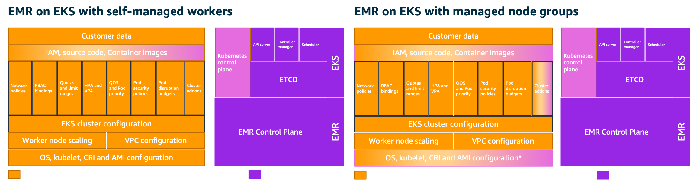
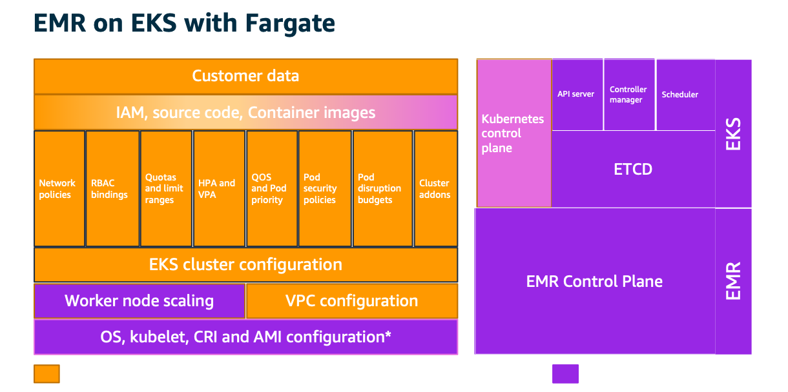

# **EMR on EKS - Encryption Best Practices**

This document will describe how to think about security and its best practices when applying to EMR on EKS service. We will cover topics related to encryption at rest and in-transit when you run EMR on EKS jobs on EKS cluster.

Its important to understand the shared responsibility model when using managed services such as EMR on EKS in order to improve the overall security posture of your environment. Generally speaking AWS is responsible for security "of" the cloud whereas you, the customer, are responsible for security "in" the cloud. The diagram below depicts this high level definition.


### Shared responsibility model

EMR on EKS provides simple way to run spark jobs on top of EKS clusters. The architecture itself is loosely coupled and is abstracted from customers so that they can run secure environment for running spark applications. Because EMR on EKS uses combination of two services (EMR and EKS) at a minimal, we will cover how EKS enables infrastructure components that are consumable by EMR spark workload and how to handle encryption for each service.

AWS assumes different levels of responsibility depending on the features being consumed by EMR on EKS customers. At this time of writing, the features from EKS are managed node groups, self-managed workers, and Fargate. We won’t go in-depth on these architectures as they are detailed in EKS best practices guide (https://aws.github.io/aws-eks-best-practices/security/docs/). Below diagrams depict how this responsibility changes between customer and AWS based on consumed features.


{: width="400"}

### Encryption for data in-transit

In this section, we will cover encryption for data in-transit. We will highlight AWS platform capabilities from the physical layer and then review how AWS handles encryption in the EMR on EKS architecture layer. Lastly, we will cover how customers can enable encryption between spark drivers and executors.

#### AWS Infrastructure - Physical layer

AWS provides secure and private connectivity between EC2 instances of all types. All data flowing across AWS Regions over the AWS global network is automatically encrypted at the physical layer before it leaves AWS secured facilities. All traffic between AZs is encrypted. All cross-Region traffic that uses Amazon VPC and Transit Gateway peering is automatically bulk-encrypted when it exits a Region. In addition, if you use Nitro family of instances, all traffic between instances is encrypted in-transit using AEAD algorithms with 256-bit encryption. We highly recommend reviewing EC2 documentation (https://docs.aws.amazon.com/AWSEC2/latest/UserGuide/data-protection.html#encryption-transit) for more information.

#### Amazon EMR on EKS

Below diagram depicts high-level architecture implementation of EMR on EKS. In this section, we will cover encryption in-transit for communication between managed services such as EMR & EKS. All traffic with AWS API’s that support EMR and EKS are encrypted by default. EKS enables Kubernetes API server using https endpoint. Both the kubelet that runs on EKS worker nodes and Kubernetes client such as kubectl interacts with EKS cluster API using TLS. Amazon EMR on EKS uses the same secure channel to interact with EKS cluster API to run spark jobs on worker nodes. In addition, EMR on EKS provides an encrypted endpoint for accessing spark history server.  

[Image: image.png]

Spark offers AES-based encryption for RPC connections. EMR on EKS customers may choose to encrypt the traffic between spark drivers and executors using this encryption mechanism. In order to enable encryption, RPC authentication must also be enabled in your spark configuration.

--conf spark.authenticate=true \
--conf spark.network.crypto.enabled=true \

The encryption key is generated by the driver and distributed to executors via environment variables. Because these environment variables can be accessed by users who has access to Kubernetes API (kubectl), we recommend securing access so that only authorized users have access to your environment. You should also configure proper Kubernetes RBAC (https://kubernetes.io/docs/reference/access-authn-authz/rbac/) permissions so that only authorized service accounts (https://kubernetes.io/docs/tasks/configure-pod-container/configure-service-account/) can use these variables.

### Encryption for data at-rest

In this section, we will cover encryption for data at-rest. We will review how to enable storage-level encryption so that it is transparent for spark application to use this data securely. We will also see how to enable encryption from spark application while using AWS native storage options.

#### Amazon S3

Amazon S3 offers server-side encryption for encrypting all data that is stored in an S3 bucket. You can enable default encryption using either S3 managed keys (SSE-S3) or KMS managed keys (SSE-KMS). Amazon S3 will encrypt all data before storing it on disks based on the keys specified. We recommend using server-side encryption at a minimum so that your data at-rest is encrypted. Please review Amazon S3 documentation (https://docs.aws.amazon.com/AmazonS3/latest/userguide/bucket-encryption.html) and use the mechanisms that apply to your encryption standards and acceptable performance.

Amazon S3 supports client-side encryption as well. Using this approach, you can let spark application to encrypt all data with desired KMS keys and upload this data to S3 buckets. Below examples shows spark application reading and writing parquet data in S3. During job submission, we use EMRFS encryption mechanism to encrypt all data with KMS key into the desired S3 location.

```
import sys

from pyspark.sql import SparkSession


if __name__ == "__main__":

    spark = SparkSession\
        .builder\
        .appName("trip-count-join-fsx")\
        .getOrCreate()

    df = spark.read.parquet('s3://<s3 prefix>/trip-data.parquet')
    print("Total trips: " + str(df.count()))

    df.write.parquet('s3://<s3 prefix>/write-encrypt-trip-data.parquet')
    print("Encrypt - KMS- CSE writew to s3 compeleted")
    spark.stop()
```

Below is the job submission request that depicts KMS specification needed for EMRFS to perform this encryption. For complete end-to-end example, please see EMR on EKS best practices documentation (https://aws.github.io/aws-emr-containers-best-practices/security/docs/spark/data-encryption/)

```
cat > spark-python-in-s3-encrypt-cse-kms-write.json <<EOF
{
  "name": "spark-python-in-s3-encrypt-cse-kms-write",
  "virtualClusterId": "<virtual-cluster-id>",
  "executionRoleArn": "<execution-role-arn>",
  "releaseLabel": "emr-6.2.0-latest",
  "jobDriver": {
    "sparkSubmitJobDriver": {
      "entryPoint": "s3://<s3 prefix>trip-count-encrypt-write.py",
       "sparkSubmitParameters": "--conf spark.executor.instances=10 --conf spark.driver.cores=2  --conf spark.executor.memory=20G --conf spark.driver.memory=20G --conf spark.executor.cores=2"
    }
  },
  "configurationOverrides": {
    "applicationConfiguration": [
      {
        "classification": "spark-defaults",
        "properties": {
          "spark.dynamicAllocation.enabled":"false"
         }
       },
       {
         "classification": "emrfs-site",
         "properties": {
          "fs.s3.cse.enabled":"true",
          "fs.s3.cse.encryptionMaterialsProvider":"com.amazon.ws.emr.hadoop.fs.cse.KMSEncryptionMaterialsProvider",
          "fs.s3.cse.kms.keyId":"<KMS Key Id>"
         }
      }
    ],
    "monitoringConfiguration": {
      "persistentAppUI": "ENABLED",
      "cloudWatchMonitoringConfiguration": {
        "logGroupName": "/emr-containers/jobs",
        "logStreamNamePrefix": "demo"
      },
      "s3MonitoringConfiguration": {
        "logUri": "s3://joblogs"
      }
    }
  }
}
EOF

aws emr-containers start-job-run --cli-input-json file:///spark-python-in-s3-encrypt-cse-kms-write.json
```

Amazon EKS offers three different storage offerings (EBS, EFS, FSx) that can be directly consumed by pods. Each storage offering provides encryption mechanism that can be enabled at the storage level.

#### Amazon EBS

Amazon EBS supports default encryption that can be turned on a per region basis. Once its turned on, you can have newly created EBS volumes and snapshots encrypted using AWS managed KMS keys. Please review EBS documentation (https://docs.aws.amazon.com/AWSEC2/latest/UserGuide/EBSEncryption.html#encryption-by-default) to learn more on how to enable this feature

You can use Kubernetes (k8s) in-tree storage driver or choose to use EBS CSI driver (https://github.com/kubernetes-sigs/aws-ebs-csi-driver) to consume EBS volumes within your pods. Both choices offer options to enable encryption. In the below example, we use k8s in-tree storage driver to create storage class (https://kubernetes.io/docs/concepts/storage/storage-classes/) and persistent volume claim (https://kubernetes.io/docs/concepts/storage/persistent-volumes/). You can create similar resources using EBS CSI driver as well.  

```
apiVersion: storage.k8s.io/v1
kind: StorageClass
metadata:
  name: encrypted-sc
provisioner: kubernetes.io/aws-ebs
volumeBindingMode: WaitForFirstConsumer
parameters:
  type: gp2
  fsType: ext4
  encrypted: "true"

apiVersion: v1
kind: PersistentVolumeClaim
metadata:
  name: spark-driver-pvc
spec:
  storageClassName: encrypted-sc
  accessModes:
    - ReadWriteOnce
  resources:
    requests:
      storage: 10Gi
```

Once these resources are created, you can specify them in your drivers and executors. You can see an example of this specification below.
```
--conf spark.kubernetes.driver.volumes.persistentVolumeClaim.data.options.claimName=spark-driver-pvc
--conf spark.kubernetes.driver.volumes.persistentVolumeClaim.data.mount.readOnly=false
--conf spark.kubernetes.driver.volumes.persistentVolumeClaim.data.mount.path=/data
...
--conf spark.kubernetes.executor.volumes.persistentVolumeClaim.data.options.claimName=spark-executor-pvc
--conf spark.kubernetes.executor.volumes.persistentVolumeClaim.data.mount.readOnly=false
--conf spark.kubernetes.executor.volumes.persistentVolumeClaim.data.mount.path=/data
```

Another approach is to let k8s create EBS volumes dynamically based on your spark workload. You can do so by specifying just the storageClass  and sizeLimit  options and specify OnDemand for the persistent volume claim (PVC). This is useful in case of Dynamic Resource Allocation (https://spark.apache.org/docs/latest/configuration.html#dynamic-allocation). Please be sure to use EMR 6.3.0 release and above to use this feature because dynamic PVC support was added in Spark 3.1. Below is an example for dynamically creating volumes for executors within your job
```
--conf spark.kubernetes.driver.volumes.persistentVolumeClaim.data.options.claimName=spark-driver-pvc
--conf spark.kubernetes.driver.volumes.persistentVolumeClaim.data.mount.readOnly=false
--conf spark.kubernetes.driver.volumes.persistentVolumeClaim.data.mount.path=/data
--conf spark.kubernetes.executor.volumes.persistentVolumeClaim.data.options.claimName=OnDemand
--conf spark.kubernetes.executor.volumes.persistentVolumeClaim.data.options.storageClass=encrypted-sc
--conf spark.kubernetes.executor.volumes.persistentVolumeClaim.data.options.sizeLimit=10Gi
--conf spark.kubernetes.executor.volumes.persistentVolumeClaim.data.mount.path=/data
--conf spark.kubernetes.executor.volumes.persistentVolumeClaim.data.mount.readOnly=false
--conf spark.kubernetes.executor.volumes.persistentVolumeClaim.spark-local-dir-spill.options.claimName=OnDemand
--conf spark.kubernetes.executor.volumes.persistentVolumeClaim.spark-local-dir-spill.options.storageClass=encrypted-sc
--conf spark.kubernetes.executor.volumes.persistentVolumeClaim.spark-local-dir-spill.options.sizeLimit=10Gi
--conf spark.kubernetes.executor.volumes.persistentVolumeClaim.spark-local-dir-spill.mount.path=/var/data/spill
--conf spark.kubernetes.executor.volumes.persistentVolumeClaim.spark-local-dir-spill.mount.readOnly=false
```
For a complete list of available options, please refer to the Spark Documentation (https://spark.apache.org/docs/latest/running-on-kubernetes.html#spark-properties)

#### Amazon EFS

Similar to EBS, you can consume EFS volumes via EFS CSI driver (https://github.com/kubernetes-sigs/aws-efs-csi-driver) and FSx for Lustre volumes via FSx CSI driver (https://github.com/kubernetes-sigs/aws-fsx-csi-driver). There are two provisioning methods before these storage volumes are consumed by workloads, namely static provisioning and dynamic provisioning. For static provisioning, you have to pre-create volumes using AWS API’s, CLI or AWS console. For dynamic provisioning, volume is created dynamically by the CSI drivers as workloads are deployed onto Kubernetes cluster. Currently, EFS CSI driver doesn’t support dynamic volume provisioning. However, you can create the volume using EFS API or AWS console before creating a persistent volume (PV) (https://kubernetes.io/docs/concepts/storage/persistent-volumes/) that can be used within your spark application. If you plan to encrypt the data stored in EFS, you need to specify encryption during volume creation. For further information about EFS file encryption, please refer to Encrypting Data at Rest (https://docs.aws.amazon.com/efs/latest/ug/encryption-at-rest.html). One of the advantages of using EFS is that it provides encryption in transit (https://aws.amazon.com/blogs/aws/new-encryption-of-data-in-transit-for-amazon-efs/) support using TLS and its enabled by default by the CSI driver. You can see the example below if you need to enforce TLS encryption during PV creation
```
apiVersion: v1
kind: PersistentVolume
metadata:
  name: efs-pv
spec:
  capacity:
    storage: 5Gi
  volumeMode: Filesystem
  accessModes:
    - ReadWriteOnce
  persistentVolumeReclaimPolicy: Retain
  storageClassName: efs-sc
  csi:
    driver: efs.csi.aws.com
    volumeHandle: fs-4af69aab
    volumeAttributes:
      encryptInTransit: "true"
```
#### Amazon FSx for Lustre

Amazon FSx CSI driver (https://github.com/kubernetes-sigs/aws-fsx-csi-driver)supports both static and dynamic provisioning. Encryption for data in-transit is automatically enabled from Amazon EC2 instances that support encryption in transit. To learn which EC2 instances support encryption in transit, see Encryption in Transit (https://docs.aws.amazon.com/AWSEC2/latest/UserGuide/data-protection.html#encryption-transit) in the Amazon EC2 User Guide for Linux Instances. Encryption for data at rest is automatically enabled when you create the FSx filesystem. Amazon FSx for Lustre supports two types of filesystems, namely persistent and scratch. You can use the default encryption method where encryption keys are managed by Amazon FSx. However, if you prefer to manage your own KMS keys, you can do so for persistent filesystem. The example below shows how to create storage class (https://kubernetes.io/docs/concepts/storage/storage-classes/) using FSx for Lustre for persistent filesystem using your own KMS managed keys.
```
kind: StorageClass
apiVersion: storage.k8s.io/v1
metadata:
  name: fsx-sc
provisioner: fsx.csi.aws.com
parameters:
  subnetId: subnet-056da83524edbe641
  securityGroupIds: sg-086f61ea73388fb6b
  deploymentType: PERSISTENT_1
  kmsKeyId: <kms_arn>
```
You can then create persistent volume claim (see an example in FSx repo (https://github.com/kubernetes-sigs/aws-fsx-csi-driver/tree/master/examples/kubernetes/dynamic_provisioning)) and use within your spark application as below
```
--conf spark.kubernetes.driver.volumes.persistentVolumeClaim.data.options.claimName=fsx-claim
--conf spark.kubernetes.driver.volumes.persistentVolumeClaim.data.mount.readOnly=false
--conf spark.kubernetes.driver.volumes.persistentVolumeClaim.data.mount.path=/data
```
#### Using Spark to encrypt data

Apache Spark supports encrypting temporary data that is stored on storage volumes. These volumes can be instance storage such as NVMe SSD volumes (https://docs.aws.amazon.com/AWSEC2/latest/UserGuide/ssd-instance-store.html), EBS, EFS or FSx volumes. Temporary data can be shuffle files, shuffle spills and data blocks stored on disk (for both caching and broadcast variables). Its important to note that the data on NVMe instance storage is encrypted using an XTS-AES-256 block cipher implemented in a hardware module on the instance. Even though, instance storage is available, you need to format and mount them while you bootstrap EC2 instances. Below is an example to show how to use instance storage using eksctl
```
managedNodeGroups:
- name: nvme
  minSize: 2
  desiredCapacity: 2
  maxSize: 10
  instanceType: r5d.4xlarge
  ssh:
    enableSsm: true
  preBootstrapCommands:
    - IDX=1
    - for DEV in /dev/disk/by-id/nvme-Amazon_EC2_NVMe_Instance_Storage_*-ns-1; do  mkfs.xfs ${DEV};mkdir -p /local${IDX};echo ${DEV} /local${IDX} xfs defaults,noatime 1 2 >> /etc/fstab; IDX=$((${IDX} + 1)); done
    - mount -a
```
If you use non-NVMe SSD volumes, you can follow the best practice to encrypt shuffle data before you write them to disks. You can see an example below that shows this example. For more information about the type of instance store volume supported by each instance type, see Instance store volumes (https://docs.aws.amazon.com/AWSEC2/latest/UserGuide/InstanceStorage.html#instance-store-volumes).
```
--conf spark.io.encryption.enabled=true
```

### Conclusion

In this document, we covered shared responsibility model for running EMR on EKS workload. We then reviewed platform capabilities available through AWS infrastructure and how to enable encryption for both storage-level and via spark application. To quote Werner Vogels, AWS CTO “Security is everyone’s job now, not just the security team’s”. We hope this document provides prescriptive guidance into how to enable encryption for running secure EMR on EKS workload.   
