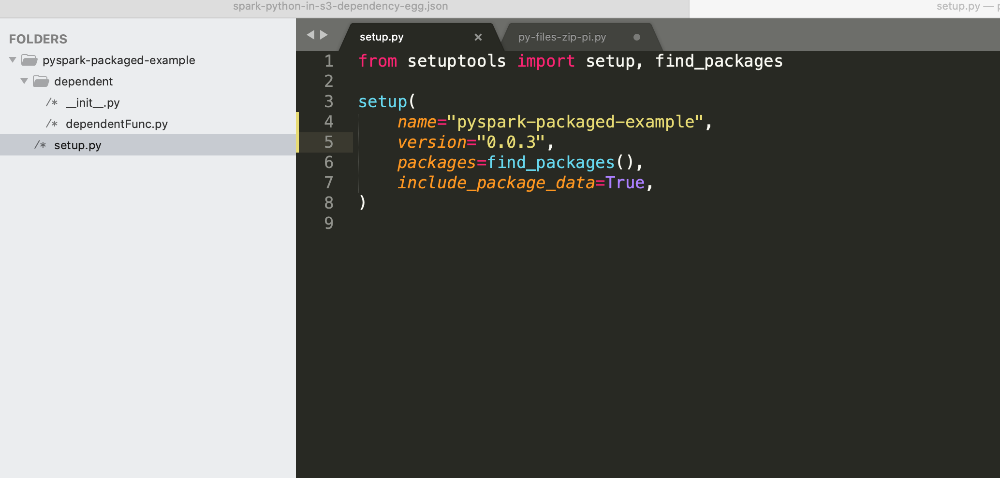

# Pyspark Job submission 

Python interpreter is bundled in the EMR containers spark image that is used to run the spark job.

### Python code self contained in a single .py file

To start with, in the most simplest scenario - the example below shows how to submit a pi.py file that is self contained and doesn't need any other dependencies. In this example pi.py is part of the spark image and is passed to the start-job-run command using local:// path prefix.

```
cat > spark-python-in-image.json << EOF
{
  "name": "spark-python-in-image", 
  "virtualClusterId": "<virtual-cluster-id>", 
  "executionRoleArn": "<execution-role-arn>", 
  "releaseLabel": "emr-6.2.0-latest", 
  "jobDriver": {
    "sparkSubmitJobDriver": {
      "entryPoint": "local:///usr/lib/spark/examples/src/main/python/pi.py", 
       "sparkSubmitParameters": "--conf spark.executor.instances=2 --conf spark.executor.memory=2G --conf spark.driver.memory=2G --conf spark.executor.cores=4"
    }
  }, 
  "configurationOverrides": {
    "applicationConfiguration": [
      {
        "classification": "spark-defaults", 
        "properties": {
          "spark.dynamicAllocation.enabled":"false"
         }
      }
    ], 
    "monitoringConfiguration": {
      "cloudWatchMonitoringConfiguration": {
        "logGroupName": "/emr-containers/jobs", 
        "logStreamNamePrefix": "demo"
      }, 
      "s3MonitoringConfiguration": {
        "logUri": "s3://joblogs"
      }
    }
  }
}
EOF

aws emr-containers start-job-run --cli-input-json file:///Spark-Python-in-image.json


```

In the below example - pi.py is placed in a mounted volume. FSx for Lustre is mounted as a Persistent Volume on the driver pod under `/var/data/` and will be referenced by local:// file prefix. For more information on how to mount FSx for lustre - refer - [EMR-Containers-integration-with-FSx-for-Lustre](../../../storage/docs/spark/fsx-lustre.md)

> This approach can be used to reference spark code and dependencies from remote locations if s3 access from driver and executor pods is not desired

```
cat > spark-python-in-FSx.json <<EOF
{
  "name": "spark-python-in-FSx", 
  "virtualClusterId": "<virtual-cluster-id>", 
  "executionRoleArn": "<execution-role-arn>", 
  "releaseLabel": "emr-6.2.0-latest", 
  "jobDriver": {
    "sparkSubmitJobDriver": {
      "entryPoint": "local:///var/data/FSxLustre-pi.py", 
       "sparkSubmitParameters": "--conf spark.executor.instances=2 --conf spark.executor.memory=2G --conf spark.driver.memory=2G --conf spark.executor.cores=4"
    }
  }, 
  "configurationOverrides": {
    "applicationConfiguration": [
      {
        "classification": "spark-defaults", 
        "properties": {
          "spark.dynamicAllocation.enabled":"false",
          "spark.kubernetes.driver.volumes.persistentVolumeClaim.sparkdata.options.claimName":"fsx-claim",
          "spark.kubernetes.driver.volumes.persistentVolumeClaim.sparkdata.mount.path":"/var/data/",
          "spark.kubernetes.driver.volumes.persistentVolumeClaim.sparkdata.mount.readOnly":"false"
         }
      }
    ], 
    "monitoringConfiguration": {
      "cloudWatchMonitoringConfiguration": {
        "logGroupName": "/emr-containers/jobs", 
        "logStreamNamePrefix": "demo"
      }, 
      "s3MonitoringConfiguration": {
        "logUri": "s3://joblogs"
      }
    }
  }
}
EOF

aws emr-containers start-job-run --cli-input-json file:///Spark-Python-in-Fsx.json


```

### Python code with dependencies bundled and passed in through —py-files spark configuration

Refer - https://spark.apache.org/docs/latest/submitting-applications.html
All dependencies for the pyspark code can be passed in the below ways

1. comma separated list of .py files
2. Bundled as a zip file
3. Bundled as a .egg file
4. Bundled as a .whl file

### comma separated list of .py files

This is not a scalable approach as the number of dependent files can grow to a large number, and also need to manually specify any of transitive dependencies.

```
cat > py-files-pi.py <<EOF
from __future__ import print_function

import sys
from random import random
from operator import add

from pyspark.sql import SparkSession
from pyspark import SparkContext

import dependentFunc

if __name__ == "__main__":
    """
        Usage: pi [partitions]
    """
    spark = SparkSession.builder.getOrCreate()
    sc = spark.sparkContext
    partitions = int(sys.argv[1]) if len(sys.argv) > 1 else 2
    n = 100000 * partitions

    def f(_):
        x = random() * 2 - 1
        y = random() * 2 - 1
        return 1 if x ** 2 + y ** 2 <= 1 else 0

    count = spark.sparkContext.parallelize(range(1, n + 1), partitions).map(f).reduce(add)
    dependentFunc.message()
    print("Pi is roughly %f" % (4.0 * count / n))

    spark.stop()
   
  EOF
    
    
```

```
cat > dependentFunc.py <<EOF
def message():
  print("Printing from inside the dependent python file")

EOF
```

Upload dependentFunc.py and py-files-pi.py to s3
Request

```
cat > spark-python-in-s3-dependency-files << EOF
{
  "name": "spark-python-in-s3-dependency-files", 
  "virtualClusterId": "<virtual-cluster-id>", 
  "executionRoleArn": "<execution-role-arn>", 
  "releaseLabel": "emr-6.2.0-latest", 
  "jobDriver": {
    "sparkSubmitJobDriver": {
      "entryPoint": "s3://<s3 prefix>/py-files-pi.py", 
       "sparkSubmitParameters": "--py-files s3://<s3 prefix>/dependentFunc.py --conf spark.executor.instances=2 --conf spark.executor.memory=2G --conf spark.driver.memory=2G --conf spark.executor.cores=4"
    }
  }, 
  "configurationOverrides": {
    "applicationConfiguration": [
      {
        "classification": "spark-defaults", 
        "properties": {
          "spark.dynamicAllocation.enabled":"false"
         }
      }
    ], 
    "monitoringConfiguration": {
      "cloudWatchMonitoringConfiguration": {
        "logGroupName": "/emr-containers/jobs", 
        "logStreamNamePrefix": "demo"
      }, 
      "s3MonitoringConfiguration": {
        "logUri": "s3://joblogs"
      }
    }
  }
}
EOF

aws emr-containers start-job-run --cli-input-json file:///spark-python-in-s3-dependency-files.json


```

### Bundled as a zip file

Points to Note:
Each dependency folder should have __init__.py file - https://docs.python.org/3/reference/import.html#regular-packages
Zip should be done at the top folder level and using the -r option for all dependency folders.
dependentFunc.py from earlier example has been bundled into a zip with package folders and attached below.

```
zip -r pyspark-packaged-dependency-src.zip . 
  adding: dependent/ (stored 0%)
  adding: dependent/__init__.py (stored 0%)
  adding: dependent/dependentFunc.py (deflated 7%)
```

[pyspark-packaged-dependency-src.zip](../../resources/pyspark-packaged-dependency-src.zip) - Place this file in a s3 location

```
cat > py-files-zip-pi.py <<EOF
from __future__ import print_function

import sys
from random import random
from operator import add

from pyspark.sql import SparkSession
from pyspark import SparkContext

**from dependent import dependentFunc**

if __name__ == "__main__":
    """
        Usage: pi [partitions]
    """
    spark = SparkSession.builder.getOrCreate()
    sc = spark.sparkContext
    partitions = int(sys.argv[1]) if len(sys.argv) > 1 else 2
    n = 100000 * partitions

    def f(_):
        x = random() * 2 - 1
        y = random() * 2 - 1
        return 1 if x ** 2 + y ** 2 <= 1 else 0

    count = spark.sparkContext.parallelize(range(1, n + 1), partitions).map(f).reduce(add)
    dependentFunc.message()
    print("Pi is roughly %f" % (4.0 * count / n))

    spark.stop()
  EOF
```

Request

```
cat > spark-python-in-s3-dependency-zip.json <<EOF
{
  "name": "spark-python-in-s3-dependency-zip", 
  "virtualClusterId": "<virtual-cluster-id>", 
  "executionRoleArn": "<execution-role-arn>", 
  "releaseLabel": "emr-6.2.0-latest", 
  "jobDriver": {
    "sparkSubmitJobDriver": {
      "entryPoint": "s3://<s3 prefix>/py-files-zip-pi.py", 
       "sparkSubmitParameters": "--py-files s3://<s3 prefix>/pyspark-packaged-dependency-src.zip --conf spark.executor.instances=2 --conf spark.executor.memory=2G --conf spark.driver.memory=2G --conf spark.executor.cores=4"
    }
  }, 
  "configurationOverrides": {
    "applicationConfiguration": [
      {
        "classification": "spark-defaults", 
        "properties": {
          "spark.dynamicAllocation.enabled":"false"
          }
      }
    ], 
    "monitoringConfiguration": {
      "cloudWatchMonitoringConfiguration": {
        "logGroupName": "/emr-containers/jobs", 
        "logStreamNamePrefix": "demo"
      }, 
      "s3MonitoringConfiguration": {
        "logUri": "s3://joblogs"
      }
    }
  }
}
EOF

aws emr-containers start-job-run --cli-input-json file:///spark-python-in-s3-dependency-zip.json


```

### Bundled as a .egg file

Create a folder structure as in the below screenshot with the code from the previous example - py-files-zip-pi.py, dependentFunc.py
Steps to create .egg file

```
cd /pyspark-packaged-example
pip install setuptools
python setup.py bdist_egg

```

Copy `dist/pyspark_packaged_example-0.0.3-py3.8.egg` to a s3 location

Request

```
cat > spark-python-in-s3-dependency-egg.json <<EOF
{
  "name": "spark-python-in-s3-dependency-egg", 
  "virtualClusterId": "<virtual-cluster-id>", 
  "executionRoleArn": "<execution-role-arn>", 
  "releaseLabel": "emr-6.2.0-latest", 
  "jobDriver": {
    "sparkSubmitJobDriver": {
      "entryPoint": "s3://<s3 prefix>/py-files-zip-pi.py", 
       "sparkSubmitParameters": "--py-files s3://<s3 prefix>/pyspark_packaged_example-0.0.3-py3.8.egg --conf spark.executor.instances=2 --conf spark.executor.memory=2G --conf spark.driver.memory=2G --conf spark.executor.cores=4"
    }
  }, 
  "configurationOverrides": {
    "applicationConfiguration": [
      {
        "classification": "spark-defaults", 
        "properties": {
          "spark.dynamicAllocation.enabled":"false"
         }
      }
    ], 
    "monitoringConfiguration": {
      "cloudWatchMonitoringConfiguration": {
        "logGroupName": "/emr-containers/jobs", 
        "logStreamNamePrefix": "demo"
      }, 
      "s3MonitoringConfiguration": {
        "logUri": "s3://joblogs"
      }
    }
  }
}
EOF

aws emr-containers start-job-run --cli-input-json file:///spark-python-in-s3-dependency-egg.json


```


### Bundled as a .whl file

Create a folder structure as in the below screenshot with the code from the previous example - py-files-zip-pi.py, dependentFunc.py
[Image: Screen Shot 2020-11-16 at 3.34.12 PM.png]Steps to create .egg file

```
cd /pyspark-packaged-example
`pip install wheel`
python setup.py bdist_wheel

```

Copy `dist/`[`pyspark_packaged_example-0.0.3-py3-none-any.whl`](https://s3.console.aws.amazon.com/s3/object/sathysar-spark-testing?region=us-west-2&prefix=jobs/pyspark_packaged_example-0.0.3-py3-none-any.whl) to a s3 location

Request

```
cat > spark-python-in-s3-dependency-wheel.json <<EOF
{
  "name": "spark-python-in-s3-dependency-wheel", 
  "virtualClusterId": "<virtual-cluster-id>", 
  "executionRoleArn": "<execution-role-arn>", 
  "releaseLabel": "emr-6.2.0-latest", 
  "jobDriver": {
    "sparkSubmitJobDriver": {
      "entryPoint": "s3://<s3 prefix>/py-files-zip-pi.py", 
       "sparkSubmitParameters": "--py-files s3://<s3 prefix>/pyspark_packaged_example-0.0.3-py3-none-any.whl --conf spark.executor.instances=2 --conf spark.executor.memory=2G --conf spark.driver.memory=2G --conf spark.executor.cores=4"
    }
  }, 
  "configurationOverrides": {
    "applicationConfiguration": [
      {
        "classification": "spark-defaults", 
        "properties": {
          "spark.dynamicAllocation.enabled":"false"
         }
      }
    ], 
    "monitoringConfiguration": {
      "cloudWatchMonitoringConfiguration": {
        "logGroupName": "/emr-containers/jobs", 
        "logStreamNamePrefix": "demo"
      }, 
      "s3MonitoringConfiguration": {
        "logUri": "s3://joblogs"
      }
    }
  }
}
EOF

aws emr-containers start-job-run --cli-input-json file:///spark-python-in-s3-dependency-wheel.json


```


### Python code with dependencies bundled - "spark.pyspark.virtualenv.enabled":"true"

This will not work - this feature only works with YARN - cluster mode
In this implementation for YARN - the dependencies will be installed from the repository for every driver and executor. This might not be a more scalable model as per https://issues.apache.org/jira/browse/SPARK-25433. Recommended solution is to pass in the dependencies as PEX file.


### Python code with dependencies bundled as a PEX file

```
`docker run ``-``it ``-``v $``(``pwd``):``/workdir python:3.7.9-buster /``bin``/``bash ``#python 3.7.9 is installed in EMR 6.1.0`
`pip3 install pex`
`pex ``--``python``=``python3`` ``--``inherit``-``path``=prefer`` ``-``v numpy ``-``o numpy_dep.pex`
```

For the commands used above -
Refer - https://github.com/pantsbuild/pex
https://readthedocs.org/projects/manypex/downloads/pdf/latest/
http://www.legendu.net/misc/blog/tips-on-pex/
http://www.legendu.net/misc/blog/packaging-python-dependencies-for-pyspark-using-pex/


Place `numpy_dep.pex` in a s3 location that is mapped to a FSx for Lustre cluster. `numpy_dep.pex` can be placed on any Kubernetes persistent volume and mounted to the driver pod and executor pod.
Request

```
cat > spark-python-in-s3-pex-fsx.json << EOF
{
  "name": "spark-python-in-s3-pex-fsx", 
  "virtualClusterId": "<virtual-cluster-id>", 
  "executionRoleArn": "<execution-role-arn>", 
  "releaseLabel": "emr-6.2.0-latest", 
  "jobDriver": {
    "sparkSubmitJobDriver": {
      "entryPoint": "s3://<s3 prefix>/kmeans.py",
      "entryPointArguments": [
        "s3://<s3 prefix>/kmeans_data.txt",
        "2",
        "3"
       ], 
       "sparkSubmitParameters": "--conf spark.executor.instances=2 --conf spark.executor.memory=2G --conf spark.driver.memory=2G --conf spark.executor.cores=4"
    }
  }, 
  "configurationOverrides": {
    "applicationConfiguration": [
      {
        "classification": "spark-defaults", 
        "properties": {
          "spark.executor.instances": "3",
          "spark.dynamicAllocation.enabled":"false",
          "spark.kubernetes.pyspark.pythonVersion":"3",
          "spark.kubernetes.driverEnv.PEX_ROOT":"./tmp",
          "spark.executorEnv.PEX_ROOT":"./tmp",
          "spark.kubernetes.driverEnv.PEX_INHERIT_PATH":"prefer",
          "spark.executorEnv.PEX_INHERIT_PATH":"prefer",
          "spark.kubernetes.driverEnv.PEX_VERBOSE":"10",
          "spark.kubernetes.driverEnv.PEX_PYTHON":"python3",
          "spark.executorEnv.PEX_PYTHON":"python3",
          "spark.pyspark.driver.python":"/var/data/numpy_dep.pex",
          "spark.pyspark.python":"/var/data/numpy_dep.pex",
          "spark.kubernetes.driver.volumes.persistentVolumeClaim.sparkdata.options.claimName":"fsx-claim",
          "spark.kubernetes.driver.volumes.persistentVolumeClaim.sparkdata.mount.path":"/var/data/",
          "spark.kubernetes.driver.volumes.persistentVolumeClaim.sparkdata.mount.readOnly":"false",
          "spark.kubernetes.executor.volumes.persistentVolumeClaim.sparkdata.options.claimName":"fsx-claim",
          "spark.kubernetes.executor.volumes.persistentVolumeClaim.sparkdata.mount.path":"/var/data/",
          "spark.kubernetes.executor.volumes.persistentVolumeClaim.sparkdata.mount.readOnly":"false"
         }
      }
    ], 
    "monitoringConfiguration": { 
      "cloudWatchMonitoringConfiguration": {
        "logGroupName": "/emr-containers/jobs", 
        "logStreamNamePrefix": "demo"
      }, 
      "s3MonitoringConfiguration": {
        "logUri": "s3://joblogs"
      }
    }
  }
}

aws emr-containers start-job-run --cli-input-json file:////Spark-Python-in-s3-pex-fsx.json
```

Point to Note:
PEX files don’t have the python interpreter bundled with it. Using the PEX env variables we pass in the python interpreter installed in the spark driver and executor docker image.
Conda-pack has the python interpreter bundled in the package.

> pex vs conda-pack
A pex file contain only Python packages but not a Python interpreter in it while a conda-pack environment has a Python interpreter as well, so with the same Python packages a conda-pack environment is much larger than a pex file.
A conda-pack environment is a tar.gz file and need to be decompressed before being used while a pex file can be used directly.
If a Python interpreter exists, pex is a better option than conda-pack. However, conda-pack is the ONLY CHOICE if you need a specific version of Python interpreter which does not exist and you do not have permission to install one (e.g., when you need to use a specific version of Python interpreter with an enterprise PySpark cluster). If the pex file or conda-pack environment needs to be distributed to machines on demand, there are some overhead before running your application. With the same Python packages, a conda-pack environment has large overhead/latency than the pex file as the conda-pack environment is usually much larger and need to be decompressed before being used.


For more information - refer http://www.legendu.net/misc/blog/tips-on-pex/ 


### Python code with dependencies bundled as a tar.gz file with conda-pack

Refer - https://conda.github.io/conda-pack/spark.html
Install conda through Miniconda - https://conda.io/miniconda.html
Open a new terminal and execute the below commands

```
conda create -y -n example python=3.5 numpy
conda activate example
pip install conda-pack
conda pack -f -o numpy_environment.tar.gz

```

Place `numpy_environment.tar.gz` in a s3 location that is mapped to a FSx for Lustre cluster. `numpy_dep.pex` can be placed on any Kubernetes persistent volume and mounted to the driver pod and executor pod.
Request

```
{
  "name": "spark-python-in-s3-conda-fsx", 
  "virtualClusterId": "<virtual-cluster-id>", 
  "executionRoleArn": "<execution-role-arn>", 
  "releaseLabel": "emr-6.2.0-latest", 
  "jobDriver": {
    "sparkSubmitJobDriver": {
      "entryPoint": "s3://<s3 prefix>/kmeans.py",
      "entryPointArguments": [
        "s3://<s3 prefix>/kmeans_data.txt",
        "2",
        "3"
       ], 
       "sparkSubmitParameters": "--verbose --archives /var/data/numpy_environment.tar.gz#environment --conf spark.executor.instances=2 --conf spark.executor.memory=2G --conf spark.driver.memory=2G --conf spark.executor.cores=4"
    }
  }, 
  "configurationOverrides": {
    "applicationConfiguration": [
      {
        "classification": "spark-defaults", 
        "properties": {
          "spark.executor.instances": "3",
          "spark.dynamicAllocation.enabled":"false",
          "spark.files":"/var/data/numpy_environment.tar.gz#environment",
          "spark.kubernetes.pyspark.pythonVersion":"3",
          "spark.pyspark.driver.python":"./environment/bin/python",
          "spark.pyspark.python":"./environment/bin/python",
          "spark.kubernetes.driver.volumes.persistentVolumeClaim.sparkdata.options.claimName":"fsx-claim",
          "spark.kubernetes.driver.volumes.persistentVolumeClaim.sparkdata.mount.path":"/var/data/",
          "spark.kubernetes.driver.volumes.persistentVolumeClaim.sparkdata.mount.readOnly":"false",
          "spark.kubernetes.executor.volumes.persistentVolumeClaim.sparkdata.options.claimName":"fsx-claim",
          "spark.kubernetes.executor.volumes.persistentVolumeClaim.sparkdata.mount.path":"/var/data/",
          "spark.kubernetes.executor.volumes.persistentVolumeClaim.sparkdata.mount.readOnly":"false"
         }
      }
    ], 
    "monitoringConfiguration": {
      "cloudWatchMonitoringConfiguration": {
        "logGroupName": "/emr-containers/jobs", 
        "logStreamNamePrefix": "demo"
      }, 
      "s3MonitoringConfiguration": {
        "logUri": "s3://joblogs"
      }
    }
  }
}
```

**The above request doesn't WORK with spark on kubernetes**
